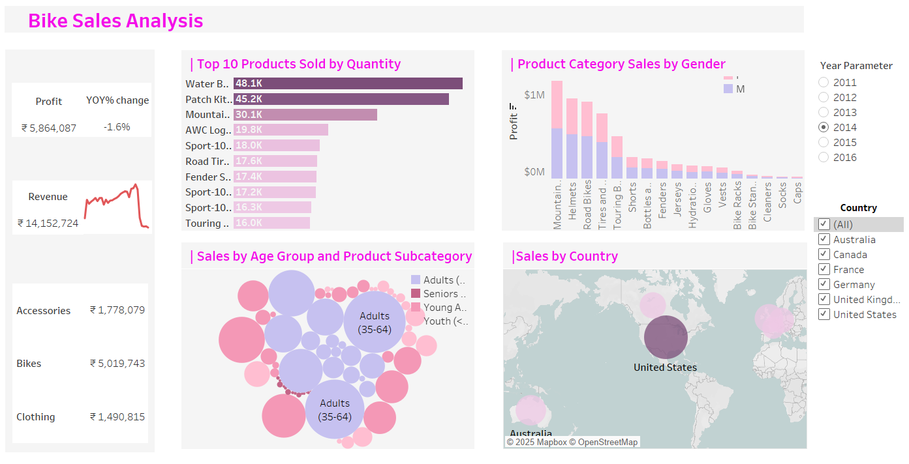

# 🚴‍♂️ Bike Sales Analysis – Tableau Dashboard

## Overview

This Tableau dashboard provides a detailed visual analysis of bike sales across various dimensions including product performance, demographic segmentation, regional distribution, and temporal trends. Designed with interactivity in mind, it enables users to explore key metrics such as revenue, profit, and product demand across time and geography.
## To Check the Project click the Tableau Public Link below,
- [🔗 Tableau Public Link](https://public.tableau.com/app/profile/subramaniyam.sa/viz/BikeSales_17483383940540/Dashboard2?publish=yes)

## 🔍 Key Insights

- **Overall Metrics**
  - 📈 **Total Profit**: ₹5,864,087
  - 💰 **Total Revenue**: ₹14,152,724
  - 📉 **YOY Profit Change**: -1.6% (calculated using a dynamic YOY growth formula)

- **Top Products Sold**
  - Most units sold: Water Bottles (48.1K), Patch Kits (45.2K), and Mountain Bikes (30.1K)
  - Strong demand in accessories and maintenance items

- **Profit by Product Category and Gender**
  - Mountain Bikes and Helmets lead in profit
  - Gender-based segmentation reveals product preference trends

- **Sales by Age Group & Subcategory**
  - Adults aged **35–64** are the dominant buyers
  - Bubble visualization highlights key subcategories by age

- **Geographical Sales Distribution**
  - The **United States** has the highest sales volume
  - Notable markets: Australia, Canada, UK, Germany, France

## 📊 Dashboard Features

- **📅 Year Parameter**
  - Interactive **Year Selector** allows users to choose specific years from 2011 to 2016
  - All charts and KPIs respond dynamically to the selected year

- **📈 YOY Profit Growth (Calculated Field)**
  - Measures **Year-on-Year** profit percentage change
  - Visualized alongside total profit to indicate growth or decline

- **🌍 Interactive Filters**
  - Filter sales data by **Country**
  - All visualizations update based on the selected region and year

- **💡 Charts & Visuals**
  - Horizontal bar chart for **Top 10 Products by Quantity**
  - Stacked bar chart for **Profit by Gender and Product Category**
  - Bubble chart for **Age Group vs. Subcategory Sales**
  - Map chart for **Country-wise Sales**

## 📁 Project Files

- `Tableau Dashboard.png` – Dashboard screenshot
- `Tableau Sales Dataset.xlsx` – Raw sales data used in Tableau
- [🔗 Tableau Public Link](https://public.tableau.com/app/profile/subramaniyam.sa/viz/BikeSales_17483383940540/Dashboard2?publish=yes)

## 🛠️ Tools & Techniques Used

- **Tableau Desktop/Tableau Public**
- **Excel** as the data source
- **Parameters** for Year Selection
- **Calculated Fields** for Previous Year Profit and to Calculate YOY Profit Growth
- **Custom Color Palette** for consistent branding
- **Dynamic Interactivity** using filters and responsive charts

## 🧠 Use Cases

- Track sales growth and product performance over time
- Analyze gender and age group preferences by product
- Assess market opportunities by country and category
- Support decision-making in sales, marketing, and inventory planning

## 📌 How to Use the Dashboard

1. Open the dashboard using the Tableau Public link.
2. Use the **Year Parameter** to select the year you want to analyze.
3. Apply country filters to focus on specific markets.
4. Hover over the charts to view tooltips with detailed insights.

## 📞 Contact

**Created by:** Subramaniyam SA  
📧 [subramaniyam45@gmail.com]
